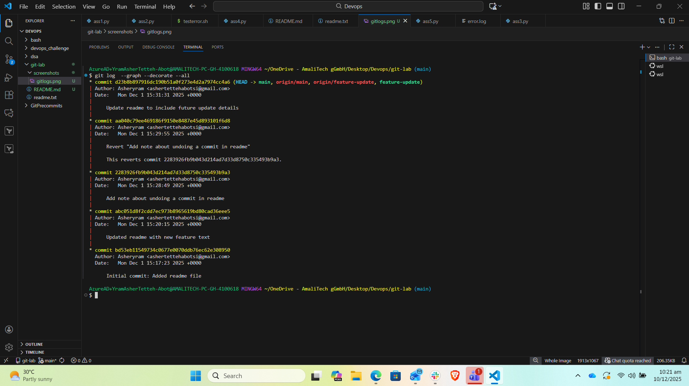

# Git Repository Management Lab

This repository contains all work completed for the **Git Repository Management Lab**.  
It includes initialization, staging, committing, branching, merging, and pushing to GitHub, along with a documented fix for a branch name issue.

---

# 📚 Lab Summary

The objective of this lab was to:
- Set up Git
- Create a local repository
- Make multiple commits
- Create and merge a feature branch
- Connect to GitHub
- Push changes
- View commit history
- Fix a push error by renaming the default branch

---

# 📝 Detailed Steps Performed

## **1. Configured Git**
```bash
git config --global user.name "Asheryram" ## set my username
git config --global user.email "ashertettehabotsi@gmail.com" ##set my email
git config --global --list ## verify if its correctly set
````
 **Observation:** I observed that git does not really check these details as they're locally set .It only does so otherwise when trying to push to a remote repository. So its advised to cross check manually


---

## **2. Initialized Local Repository**

```bash
mkdir git-lab ## created a git-lab folder
cd git-lab  ## go into that file
git init ## initialize the repository 
```

---

## **3. Created First File and Commit**

```bash
echo "Hello Git!" > readme.txt ## I stored the string `Hello Git!` in a readme.txt file 
git status ## I checked the status of the files of the git initialised repo
git add readme.txt ## I staged it meaning I am preparing to store on the remote
git commit -m "Initial commit: Added readme file" ## I finally commited to keep a state of that file and track it 
```

---

## **4. Created and Switched to Feature Branch**

```bash
git branch feature-update ## I wanted to work elsewhere and not affect the root branch so I created a new branch feature-update
git checkout feature-update ## I used this to set the Header pointer to the feture-update branch
```

---

## **5. Updated File and Made Second Commit**

```bash
echo "New feature added!" >> readme.txt 
git add readme.txt
git commit -m "Updated readme with new feature text"
```

---

## **6. Attempted to Switch to Main Branch**

```bash
git checkout main ##switch to the main branch
```

 **Issue:** Git showed an error because the repository still used **master** as the default branch.

 **Fix: Renamed `master` → `main`**
   To match GitHub’s default branch:

```bash
git branch -M main ## So I forced renamed the master to main. The -M is to enforce it does the change even if there already exist a brach with that name
```


## **7. Merged Feature Branch Into Main**

```bash
git merge feature-update ## I combined the changes to the main branch
```

---

## **8. Added Remote GitHub Repository**

```bash
git remote add origin https://github.com/Asheryram/git-lab ## adding remote branch created in github to my local version
```

---

## **9. Pushed Repository to GitHub**

```bash
git push -u origin main ## I pushed to the origin main . -u flag was to set it to upstream so i don't always have to specify origin alias and use git push only
```

---

## **10. Viewed Commit History**

```bash
git log --oneline --graph --decorate --all ## I wanted to view my branch logs
```

---

### 📄Picture of Git history (Command History)

This section summarizes the actual Git activity:


---

# Lab Deliverables Achieved

* Local Git repository created
* At least **two commits** completed
* **Feature branch** created and merged
* GitHub repository created and synced
* Understood:

  * staging
  * committing
  * branching
  * merging
  * pushing
* Solved a branch naming issue (`master` → `main`)
---
